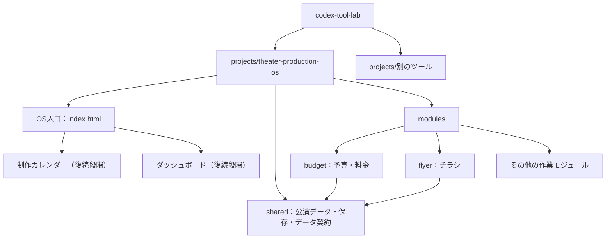

# 劇団制作OSの構成と開発段階

## 採用する配置

OSを1つのプロジェクトとして管理し、機能モジュールをその子に置く。
仕様登録の入口は `index.md`、アプリの入口は実装時に作る `index.html`。
モジュールは `modules/<module-id>/index.html` から単独起動できる。

公演マスター、共通保存、予算はphase-1で実装済み。図の他モジュール・カレンダー・ダッシュボードは計画。
カレンダーとダッシュボードはOS側の横断UI。各モジュールは公演ID、モジュールID、作業IDを介して接続する。
初期の表示構成は最小の公演入力とモジュールへの導線でよい。

## 責務と境界

| 場所 | 責務 |
| --- | --- |
| OSの入口 | 公演の作成・選択、モジュールへの導線。後にカレンダー・ダッシュボード |
| shared/ | 公演マスター、保存・復元、検証、ID、schemaVersion、モジュール用アダプタ |
| modules/<id>/ | 固有入力・計算・表示・出力。保存処理の複製はしない |
| docs/specs/ | Notion統合仕様の取得版 |
| SPEC.md | 現在の実装範囲・受入条件・原本から具体化した判断 |
| TASK.md | 今回の作業単位 |
| docs/archive/ | 差し替えた設計資料、完了した作業指示 |
| artifacts/ | 検証記録と小さな架空サンプル |

共通処理はこのOS内だけで共有する。別ツール用のルート共通ライブラリにはしない。
単体起動でも同じ公演・保存アダプタを使う。統合時は選択した公演IDをモジュールへ渡す。
同じ公演の値をモジュール固有データへコピーせず、公演マスターを参照する。
モジュール固有の数値は公演内の `modules.<module-id>.data` に保存する。

## 段階ごとの完了

| 段階 | 作るもの | 完了の目安 |
| --- | --- | --- |
| 0：仕様登録 | 全文仕様、構成、データ契約、最初のSPEC/TASK | 設計書を読み次の作業に着手できる |
| 1 | 最小公演マスター・共通保存・予算モジュール | 今回のSPECの全受入条件を満たす |
| 2 | チラシ・配布・SNS・販売進捗から順次追加 | 単体で実用的な3〜5モジュール |
| 3 | 横断カレンダー、逆算予定、今日・今週、ダッシュボード | 統合仕様15章のOS MVP必須項目を満たす |
| 4 | 稽古、提出物、受付、決算、既存タイムスケジュール接続など | モジュールごとのSPEC/TASKで定義 |
| 5 | 必要に応じクラウド同期・共有 | 別仕様で保存・権限を設計 |

この段階分けはリポジトリ導入時の提案。原本の推奨順を基本にし、原本で優先度が高い「稽古」「劇場提出物」は実務に応じて前倒しできる。
初回の予算単体完成を「制作OS完成」と呼ばない。カレンダー等の受入条件は該当段階のSPECに追加する。

## 入口・リンク・配布

OSからモジュールへは相対URLで移動する。ルート絶対パスを避け、サブディレクトリに配置してもリンクが壊れないようにする。
`projectId` のURLパラメータを渡す方式を初回案とし、未知のIDは選択・作成画面へ案内する。
単体起動時も同じUIで公演を作成または選択できるようにする。複数公演一覧は初回必須ではない。
複数タブの競合解決は初回対象外で、その制約をREADMEへ記す。
ビルド成果物の保存・公開方法は実装方式が決まった時点で定義する。

## 今回の判断とNotion反映

2026-09-30：既存projects規約に合わせてOSを1プロジェクト、モジュールを子フォルダに置く。
静的HTMLの入口をプロジェクト直下にする構成を採用する。既存テンプレートのsrc規約からの変更理由は、OS入口と単体モジュール入口の階層を見える形で揃えるため。
保存データのラッパー・ID・日時・予算の具体式は [共通データ契約](data-contract-v0.1.md) と [SPEC](../SPEC.md) の提案。
原本の保存方式・モジュール独立性・MVP境界を狭めて最初のタスクに切り出した。
Notion反映は採用後に必要。今回、Notionを編集していない。
